# Light-Responsive Alarm System (ESP32)

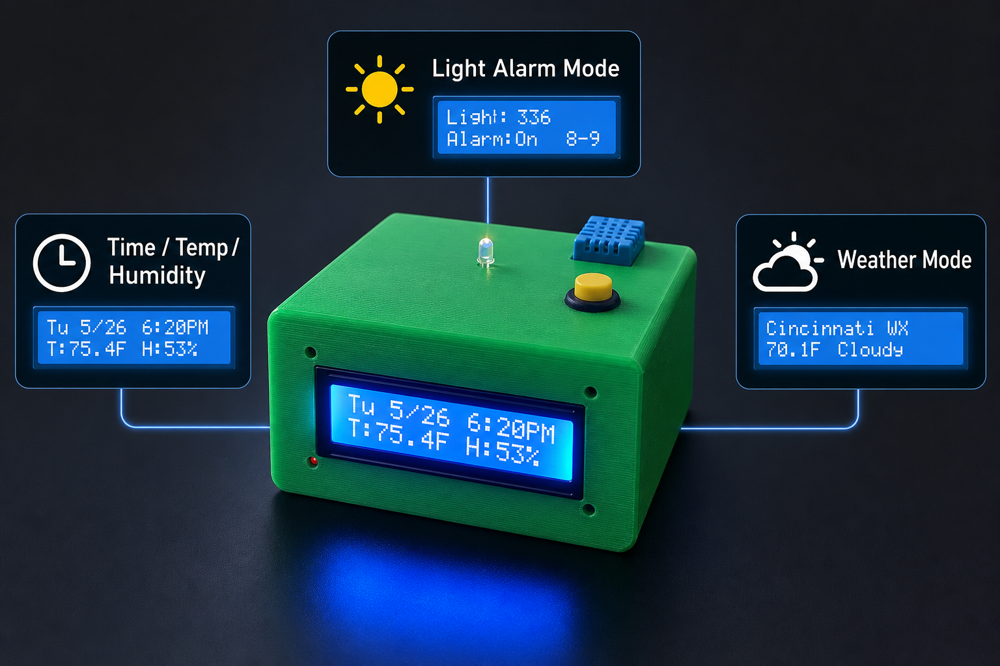

## Overview

This repository documents a personal embedded systems project: a light-responsive alarm clock prototype built around an ESP32. The system combines ambient light sensing, indoor temperature/humidity monitoring, RTC-based timekeeping, Wi-Fi weather data, a one-button LCD interface, buzzer output, a KiCad schematic, and a custom Fusion 360 enclosure.

The project started from a practical idea: during weekends or breaks, I wanted a way to wake up more naturally by responding to sunlight instead of relying only on a sudden fixed alarm sound. I also wanted a quick way to check the weather before leaving, so I combined both ideas into one desk-clock-style prototype.

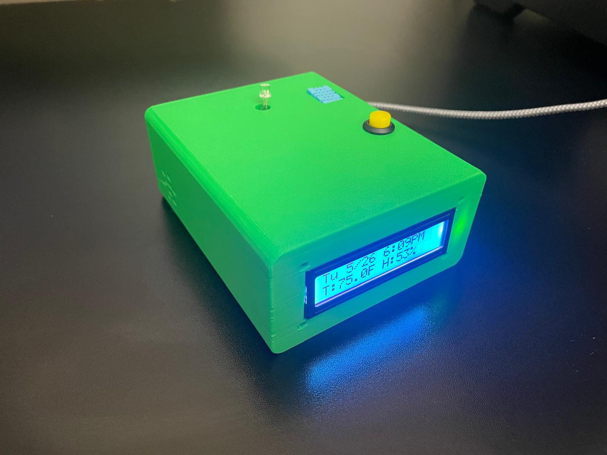

## What It Does

- Displays date, time, indoor temperature, and indoor humidity.
- Displays ambient light level and whether the morning light alarm is active.
- Displays outside weather for the Cincinnati / University of Cincinnati area.
- Uses a DS3231 RTC module to keep time after startup.
- Uses Wi-Fi at startup for NTP time synchronization.
- Fetches outside weather data periodically using Open-Meteo.
- Uses ambient light to trigger a passive buzzer during a set morning window.
- Uses one button to switch display modes, dismiss the alarm, and sleep/wake the LCD backlight.

## Display Modes

| Mode | Display | Purpose |
|---|---|---|
| 1 | Date/time + indoor temperature/humidity | Main clock and indoor environment view |
| 2 | Light level + alarm status | Shows ambient light and alarm window status |
| 3 | Cincinnati weather | Shows outside temperature and weather condition |

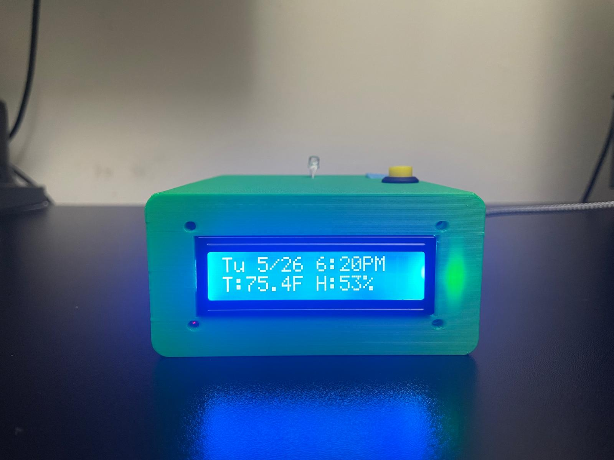
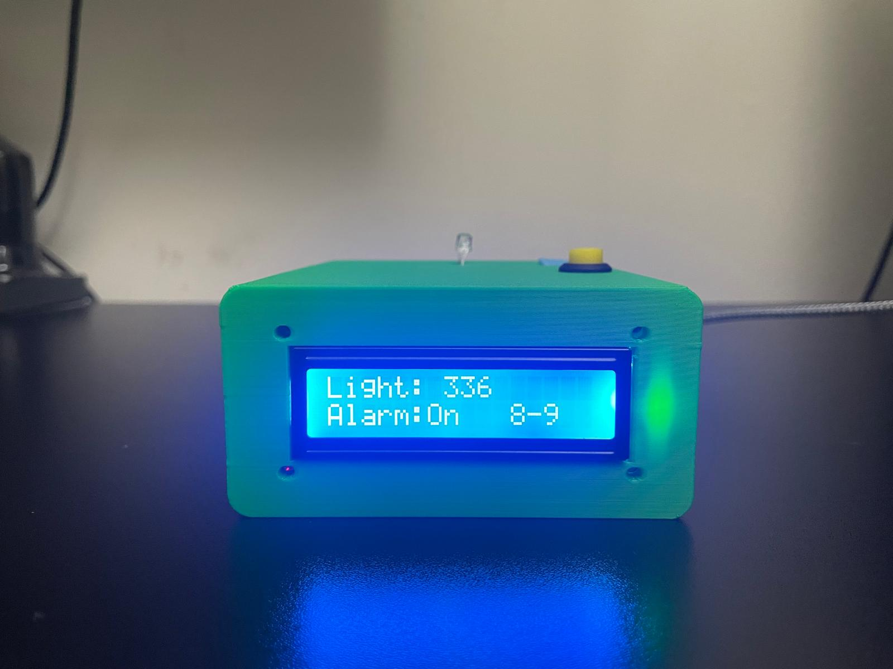
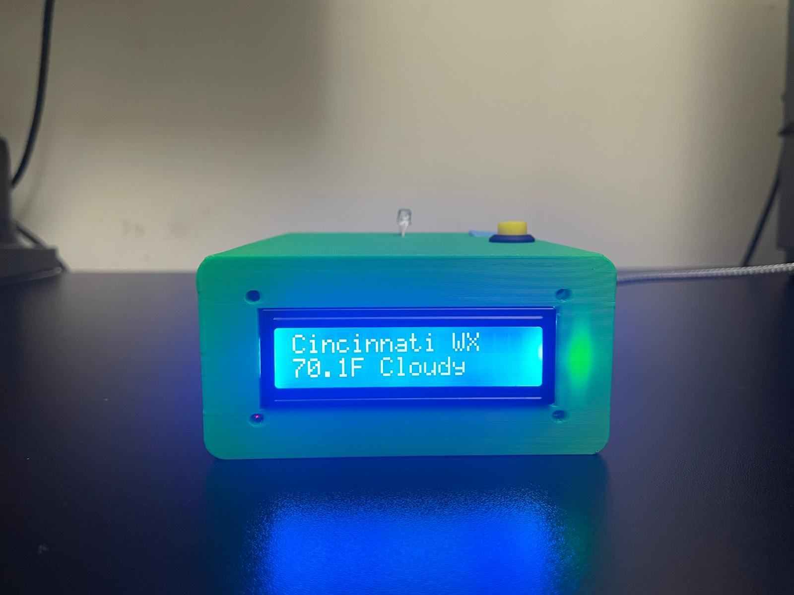

## Hardware

- ESP32 development board
- 16x2 I2C LCD display
- DS3231 RTC module
- DHT11 temperature/humidity sensor module
- Phototransistor light sensor circuit
- 10k resistor for the light sensor voltage divider
- Passive buzzer
- Momentary push button
- USB-C panel extension
- Soldered perfboard / internal wiring
- Custom 3D-printed enclosure designed in Fusion 360

## Pin Map

| Function | ESP32 Pin |
|---|---|
| LCD SDA | GPIO21 |
| LCD SCL | GPIO22 |
| DS3231 SDA | GPIO21 |
| DS3231 SCL | GPIO22 |
| DHT data | GPIO27 |
| Phototransistor ADC | GPIO35 |
| Passive buzzer | GPIO25 |
| Push button | GPIO26 |
| LCD VCC | 5V / VIN |
| DHT VCC | 3.3V |
| DS3231 VCC | 3.3V |
| Phototransistor circuit VCC | 3.3V |
| Grounds | Common GND |

The LCD and DS3231 share the ESP32 I2C bus on GPIO21 and GPIO22.

## Firmware

The Arduino sketch is located in:

```text
src/light_responsive_alarm/light_responsive_alarm.ino
```

Main firmware behavior:

- Connects to Wi-Fi at startup.
- Synchronizes local time from NTP.
- Updates the DS3231 RTC from the synchronized time.
- Reads time from the RTC during normal operation.
- Samples and averages analog light readings.
- Reads DHT temperature/humidity at a slower interval.
- Fetches weather data about every 30 minutes.
- Updates the LCD display every 500 ms.
- Handles short press, long press, sleep/wake, and alarm dismissal behavior from one button.

Local Wi-Fi credentials should be placed in a private `config.h` file based on:

```text
src/light_responsive_alarm/config_example.h
```

Do not commit real Wi-Fi credentials.

## CAD and Enclosure

The enclosure was designed in Fusion 360 to move the project beyond a loose breadboard prototype. The design includes:

- Front LCD opening
- Top-mounted button
- Top sensor openings
- Buzzer sound holes
- USB-C access
- Internal room for the ESP32, RTC, DHT sensor, buzzer, wiring, and connectors

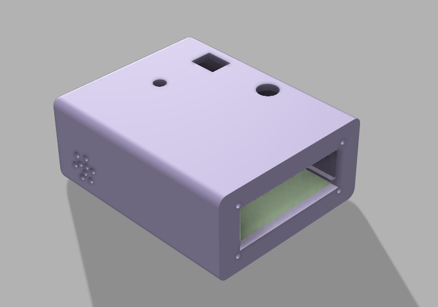
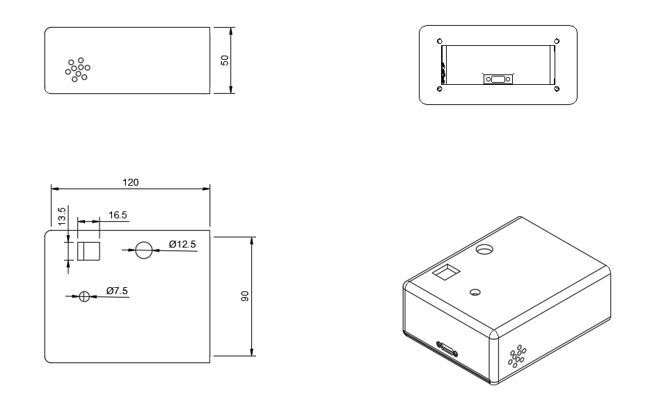

## Schematic

The schematic was documented in KiCad and is included under:

```text
hardware/kicad/
```

The schematic is primarily a wiring/documentation schematic for the prototype, not a finalized manufactured PCB design.

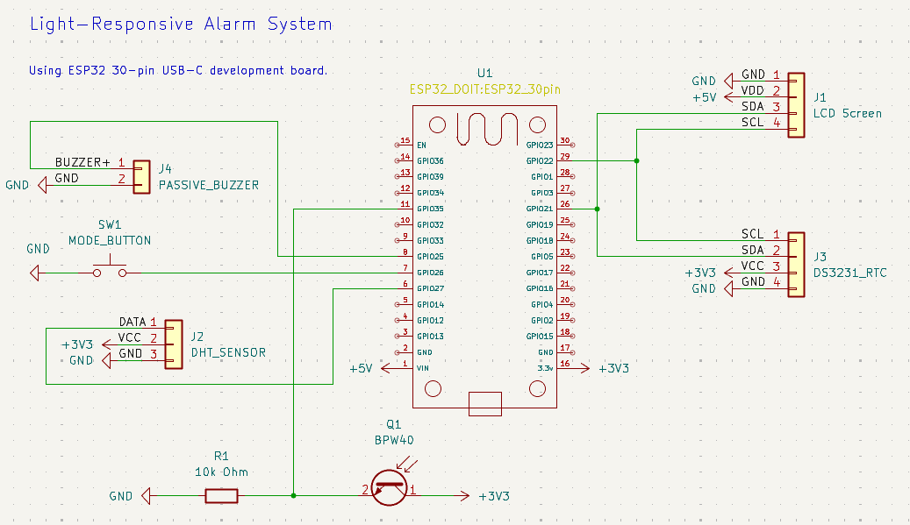

## Build Photos

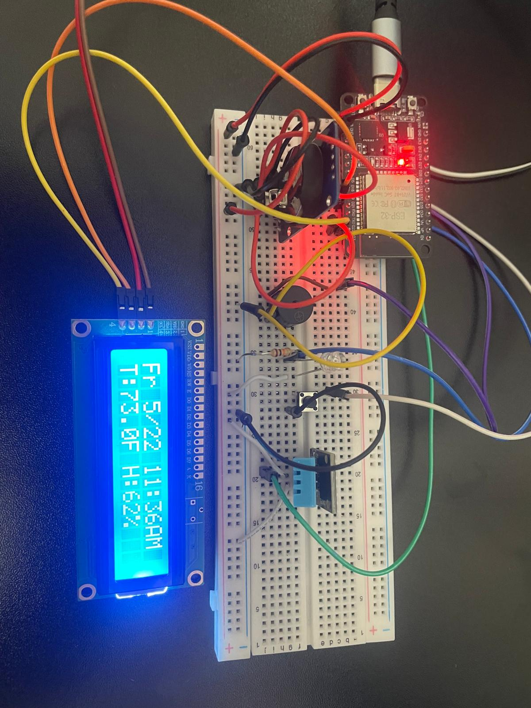
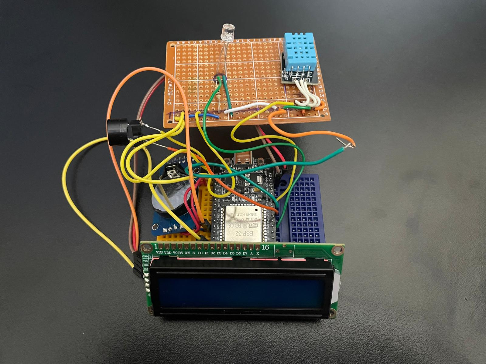
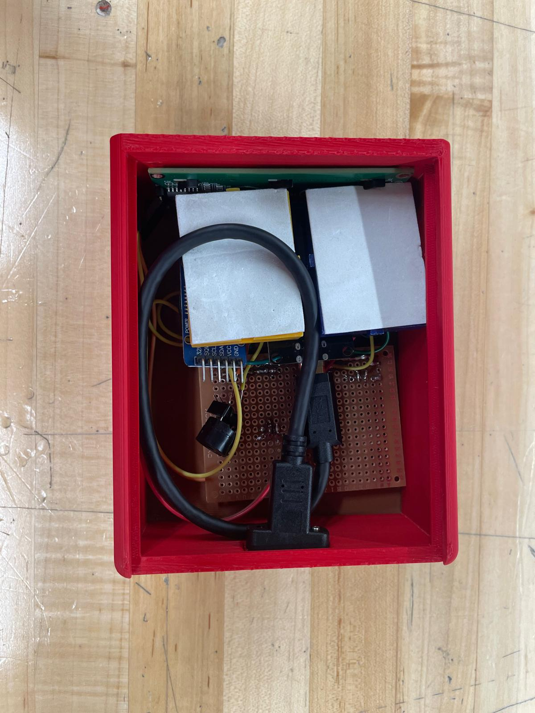

## Challenges and Lessons Learned

- The LCD was difficult to read at 3.3V and worked better when powered from 5V.
- The original temperature sensing approach was replaced with a DHT temperature/humidity module after debugging unrealistic readings.
- The ESP32 ADC light readings needed averaging to reduce noise.
- NTP time sync was made more reliable by using multiple NTP servers.
- Fitting the wiring, LCD, USB-C access, button, buzzer, and sensors into the enclosure required more iteration than the early breadboard version.
- Waiting for 3D printer availability slowed the project more than the code or wiring.

## Limitations and Future Improvements

- Add non-volatile storage for alarm window and light threshold settings.
- Add a dedicated settings interface instead of hard-coded alarm values.
- Add hysteresis/filtering around the light threshold to reduce false triggers.
- Add more robust Wi-Fi reconnect and weather fetch error handling.
- Use a level shifter if mixing 5V LCD I2C pullups with 3.3V ESP32/RTC logic in a more permanent revision.
- Convert the wiring schematic into a cleaner PCB or perfboard layout.
- Improve enclosure tolerances after more print/fit testing.

## Repository Structure

```text
.
|-- README.md
|-- src/
|   `-- light_responsive_alarm/
|       |-- light_responsive_alarm.ino
|       `-- config_example.h
|-- hardware/
|   `-- kicad/
|       |-- Light_Alarm.kicad_pro
|       |-- Light_Alarm.kicad_sch
|       `-- Light_Alarm.kicad_pcb
|-- cad/
|   `-- README.md
`-- docs/
    `-- images/
```

## Notes

This is a student-built embedded systems prototype, not a commercial alarm product. The goal was to practice hardware/software integration, sensor interfacing, debugging, CAD design, and project documentation.
